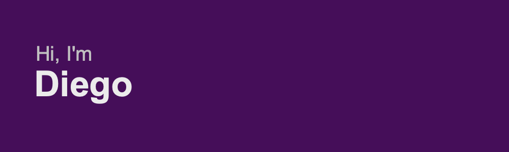

I'm a freelancer training in Front-End and Back-End. 

 
 

I love using for development 😎 --> 

This are the Frameworks and dev. tools that I'm trained for:

         

This is the tool I currently use:

This are the languages I currently use to development 💻

        

 

